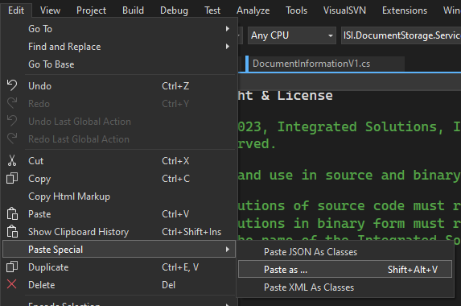
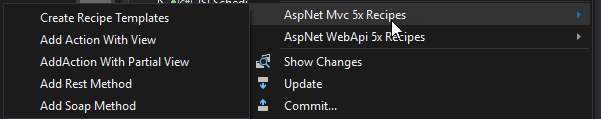

# ISI.VisualStudio.Extensions

To install, add https://vsextensions.isi-net.com/gallery/feed.xml to

Options -> Environment -> Extensions and Updates

###  AppSettings

* Add Transform

### Cake

* Execute Default Target

* Execute Target

### Clipboard

* PasteAs

Put CSV into your clipboard

or

Put Class properties into your clipboard

Then

To make properties click Properties on

Then pick your options

To make conversions click Conversion

Then pick your options

* Paste As Cmd (only if you use ISI.Libraries.DB)

Before

After

### Guid

* Insert New Guid (ctrl-shift-g)

### Jenkins

* Pull from Jenkins

* Push from Jenkins

### Nuget

* Copy References As Nuget Packages

* Paste Nuget Packages

### Library Manager

* Add Missing Projects - Looks through all of your references in your solution/project and checks if there is local source for them, if there is and the project is not already part of the solution, it is added to the solution

* Use ISI Projects - Looks through all of your references in your solution/project, if you are using ISI nugets and there is local source code for them, then the nuget is replaced with the source code

### Project Manager

* Add Embedded Resources

### Recipe Manager

* AspNet Mvc 5x

* AspNet WebApi 5x

* Partial Classes

Add new Partial Class

Add new Partial Class Method

### Solution Manager

Adds following files to solution directory:

### Transformation Manager

